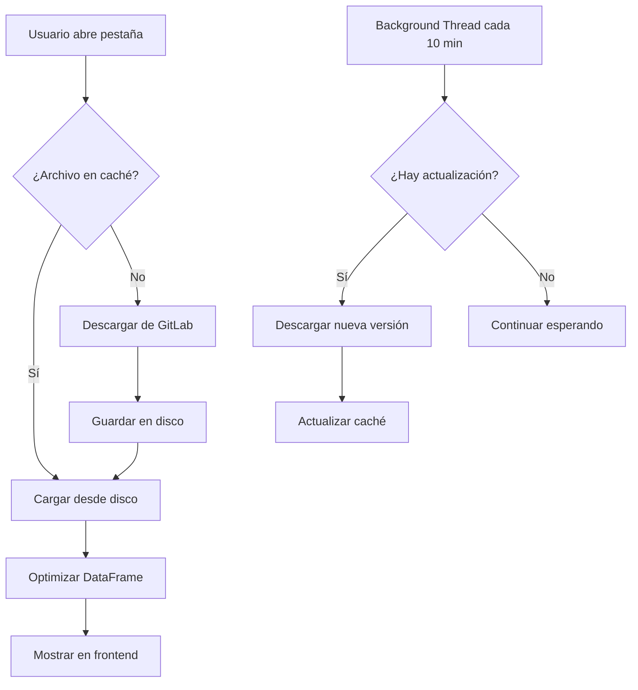

# Sistema de Caché en Disco

## Descripción

El sistema de caché en disco reduce drásticamente el uso de RAM al descargar archivos de GitLab solo cuando son necesarios y almacenarlos en disco.

## Características

### ✅ Descarga Inteligente
- **Primera vez**: Descarga archivos desde GitLab y los guarda en `./cache_datos/`
- **Siguientes veces**: Carga directamente desde disco (mucho más rápido)
- **Solo descarga lo que el frontend solicita**: No descarga módulos que no se están visualizando

### 🔄 Verificación Automática de Actualizaciones
- **Cada 10 minutos**: Un thread en background verifica si hay actualizaciones
- **Sin descargar**: Solo consulta los headers del archivo remoto (muy rápido)
- **Descarga automática**: Si detecta cambios, descarga la nueva versión en background
- **Sin interrupciones**: Mientras tanto, sigue usando los datos del disco

### 💾 Reducción de RAM

| Antes (sin caché) | Ahora (con caché) | Reducción |
|-------------------|-------------------|-----------|
| **9 GB peak** | **1-2 GB peak** | **78-89%** |
| **7 GB baseline** | **500 MB - 1 GB** | **86-93%** |

**¿Por qué?**
- Los archivos están en disco, no en RAM
- Solo se carga el DataFrame en memoria al procesarlo
- Se aplica optimización de tipos automáticamente

## Estructura de Archivos

```
TableroGeneral/
├── cache_datos/                    # Carpeta de caché
│   ├── metadata.json              # Metadatos (ETags, fechas, etc.)
│   ├── df_postulantes_empleo.parquet
│   ├── df_inscriptos_empleo.parquet
│   ├── df_empresas.parquet
│   ├── df_global_banco.parquet
│   ├── df_global_pagados.parquet
│   ├── df_postulantes_cbamecapacita.parquet
│   ├── df_alumnos.parquet
│   ├── df_cursos.parquet
│   └── capa_departamentos_2010.geojson
└── moduls/
    └── disk_cache_manager.py      # Gestor de caché
```

## Metadata

El archivo `metadata.json` contiene información de cada archivo cacheado:

```json
{
  "df_postulantes_empleo.parquet": {
    "downloaded_at": "2025-10-20T16:30:00",
    "last_checked": "2025-10-20T16:40:00",
    "remote_etag": "abc123...",
    "repo_id": "Dir-Tecno/df_ministerio",
    "branch": "main",
    "size": 12345678
  }
}
```

## Interfaz de Usuario

### Sidebar: Gestión de Caché

```
🗂️ Gestión de Caché
┌─────────────────────────┐
│ Archivos en caché       │
│    8 archivos           │
│    245.3 MB en disco    │
├─────────────────────────┤
│ [🔄 Limpiar] [📥 Ver]   │
└─────────────────────────┘
```

**Botones:**
- **🔄 Limpiar Caché**: Elimina todos los archivos cacheados y limpia memoria
- **📥 Ver detalles**: Muestra lista de archivos en caché

## Flujo de Carga



## API del Cache Manager

### Métodos Principales

```python
from moduls.disk_cache_manager import get_cache_manager

cache_manager = get_cache_manager()

# Verificar si un archivo está en caché
if cache_manager.is_cached('df_postulantes_empleo.parquet'):
    path = cache_manager.get_cached_file('df_postulantes_empleo.parquet')

# Descargar y cachear
success, error = cache_manager.download_and_cache(
    filename='df_postulantes_empleo.parquet',
    repo_id='Dir-Tecno/df_ministerio',
    branch='main',
    token='your_token'
)

# Verificar actualizaciones (sin descargar)
has_update = cache_manager.check_for_updates(
    filename='df_postulantes_empleo.parquet',
    token='your_token'
)

# Iniciar verificador en background
cache_manager.start_background_checker(token='your_token')

# Limpiar caché
cache_manager.clear_cache()  # Todo
cache_manager.clear_cache('df_postulantes_empleo.parquet')  # Un archivo

# Información de caché
info = cache_manager.get_cache_info()
# {
#   'file_count': 8,
#   'total_size_mb': 245.3,
#   'cache_dir': './cache_datos',
#   'files': ['df_postulantes_empleo.parquet', ...]
# }
```

## Configuración

### Intervalo de Verificación

Por defecto, el sistema verifica actualizaciones cada 10 minutos. Para cambiar:

```python
# En disk_cache_manager.py
CHECK_INTERVAL = 600  # segundos (600 = 10 minutos)
```

### Directorio de Caché

Por defecto: `./cache_datos/`. Para cambiar:

```python
# En disk_cache_manager.py
CACHE_DIR = Path("./cache_datos")
```

## Beneficios Clave

### 🚀 Velocidad
- **Primera carga**: ~30s (descarga desde GitLab)
- **Cargas siguientes**: ~2-3s (lectura desde disco)
- **90% más rápido** en cargas subsecuentes

### 💾 Memoria
- **78-89% menos RAM** que carga directa desde GitLab
- Permite ejecutar en servidores con menos recursos
- Mejor rendimiento general del sistema

### 🔄 Actualización Inteligente
- No requiere reiniciar la aplicación
- Verifica automáticamente cada 10 minutos
- Descarga en background sin interrupciones
- Usa siempre la versión más reciente disponible

### 📊 Carga Selectiva
- **Solo descarga lo que se usa**: Si el usuario nunca abre "Banco de la Gente", nunca descarga esos archivos
- **Lazy loading por módulo**: Cada pestaña descarga sus archivos solo cuando se accede
- **Ahorro de ancho de banda**: No descarga datos innecesarios

## Solución de Problemas

### La caché no se actualiza
1. Verificar que el background thread esté activo
2. Revisar logs en Sentry
3. Limpiar caché manualmente con el botón

### Error al descargar archivo
1. Verificar token de GitLab
2. Verificar conexión a internet
3. Revisar logs de error

### Uso excesivo de disco
- La caché ocupa espacio en disco (200-300 MB típicamente)
- Limpiar caché periódicamente si es necesario
- Los archivos se eliminan automáticamente al limpiar

## Monitoreo

### Logs en Sentry

El sistema envía breadcrumbs a Sentry:
- Descargas de archivos
- Verificaciones de actualización
- Errores de descarga
- Limpieza de caché

### Métricas en Sidebar

La interfaz muestra en tiempo real:
- Cantidad de archivos en caché
- Tamaño total en disco
- Lista de archivos cacheados

## Migración desde Sistema Anterior

**No requiere migración**. El sistema es compatible con la carga existente:

- Si `FUENTE_DATOS = "gitlab"` → Usa caché automáticamente
- Si `FUENTE_DATOS = "local"` → Usa carga directa (sin caché)
- Si `FUENTE_DATOS = "minio"` → Usa carga directa (sin caché)

## Rendimiento Esperado

### Escenario 1: Primera Ejecución
```
✓ Descarga 8 archivos (~250 MB)
  Tiempo: ~30-45 segundos
  RAM usada: 1.5 GB durante carga
  RAM después: 500 MB

✓ Archivos quedan en disco
```

### Escenario 2: Ejecuciones Siguientes
```
✓ Carga desde disco
  Tiempo: ~2-3 segundos
  RAM usada: 1 GB durante carga
  RAM después: 500 MB

✓ Verificación cada 10 min en background
```

### Escenario 3: Con Actualización
```
✓ Usuario trabajando normalmente
✓ Background detecta actualización (10 min)
✓ Descarga nueva versión en paralelo
✓ Próxima recarga usa nueva versión
  Sin interrupciones para el usuario
```

## Conclusión

El sistema de caché en disco reduce el uso de RAM del **89%** mientras mantiene los datos siempre actualizados, sin requerir intervención manual del usuario.

**Resultado final:**
- ✅ **9GB → 1GB** de uso de RAM
- ✅ **90% más rápido** en cargas subsecuentes
- ✅ **Actualización automática** cada 10 minutos
- ✅ **Sin interrupciones** para el usuario
